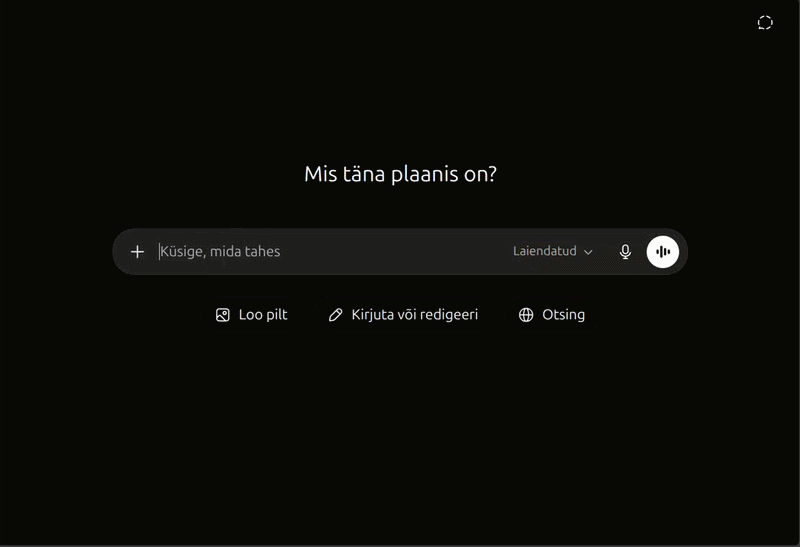
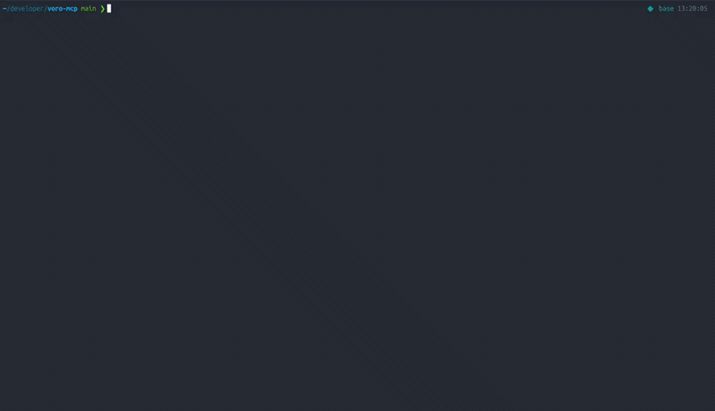

<h1 align="center">Võro MCP Server</h1>

<p align="center">
  Give Claude, Codex, ChatGPT, and other MCP clients tools for working with the Võro language.
</p>

<p align="center">
  
  
  
  
  
</p>

<p align="center">
  
</p>

An MCP server for working with the Võro language: local dictionary and corpus
lookup, GiellaLT-backed analysis/spellcheck/grammar tools, and Neurotõlge
translation.

## What it's for

This MCP server gives language models practical tools for working with the Võro language. Võro is a lower-resource language, so general-purpose language models may make more mistakes with it than with widely supported languages such as English, or even Estonian.

By connecting the model to dictionaries, corpus search, morphological analysis, spellchecking, grammar checking, translation, and form generation, this server helps improve the model’s ability to understand, generate, correct, and translate Võro text.

It can be useful for tasks such as Võro translation, checking and improving generated text, exploring real usage examples, generating word forms, detecting unknown words, and supporting people who are learning or working with the Võro language.

## Install

### Quick setup

On Debian/Ubuntu, one command does the whole setup.

```sh
make setup        # scripts/run_local_ubuntu.sh; see `make help` for every task
```

You need `make`, Python, and the usual shell tools installed first. The setup
target installs the HFST/Divvun system binaries (adding the Apertium package
repo first if your system can't already find `divvun-gramcheck`), downloads the
SQLite datasets and the prebuilt Giella models, creates `.venv`, and installs
the package. Smoke-test it with `make test`.

`make test` runs straight from the checkout (no install needed). Tests that need
the SQLite datasets or the Giella tools **skip with a hint** when those aren't
present, so a bare clone still reports green — run `make data` and `make giella`
(or the full `make setup`) to actually exercise them.

<details>
<summary><strong>Manual setup</strong> (other platforms, or to see the pieces)</summary>

<br />

1. **System binaries** the Giella tools shell out to: `hfst-optimized-lookup`,
   `hfst-ospell`, `cg3`, `divvun-checker`. On Debian/Ubuntu they come from the
   Apertium nightly apt repo:

   ```sh
   curl -fsSL https://apertium.projectjj.com/apt/install-nightly.sh | sudo bash
   sudo apt-get install -y hfst hfst-ospell cg3 divvun-gramcheck perl gawk bash
   ```

2. **The package**, into a virtualenv (`make install`):

   ```sh
   python3 -m venv .venv
   . .venv/bin/activate
   pip install -e .
   ```

3. **Data and models**, they are pulled from GitHub releases:

   ```sh
   scripts/fetch_data.sh
   scripts/fetch_giella.sh
   ```

4. **Verify** the external tools resolved (prints JSON and exits):

   ```sh
   vro-mcp-check
   ```

</details>

## Tools

| Tool | What it does |
| --- | --- |
| `lookup_word` | Dictionary lookup (en↔vro). |
| `find_usage_examples` | Full-text corpus search for real usage. |
| `word_exists_in_bag` | Fast check whether a word form has been seen. |
| `find_unknown_words` | List word forms in a text absent from the word bag. |
| `find_unrecognized_words` | List text word forms that the GiellaLT analyzer returns as `+?`, with optional word-bag prefiltering. |
| `analyze_word` | GiellaLT morphological analysis. |
| `generate_forms` | GiellaLT generation for one exact lemma + tag analysis. |
| `spellcheck_vro` | Token-level spellcheck with suggestions. |
| `grammar_check_vro` | Sentence-level grammar check. |
| `find_estonian_leakage` | Scan a larger text and return a slim, deduped list of word forms (and phrases) with Estonian-looking endings. |
| `lint_estonian_leakage` | In-depth check of specific words/phrases: rule IDs, severities, messages, and hints. |
| `suggest_correction` | Analyzer-verified fixes for a bad/unknown form. |
| `translate_vro` | Neurotõlge/TartuNLP translation. |
| `check_setup` | Report database and external Giella tool availability. |

Most lookup tools accept a single word or a list for batched queries.

The open dictionary currently covers English↔Võro only.

## Resources

Markdown references are exposed over MCP:

- `vro://grammar/noun-cases`: noun/adjective/numeral/pronoun declension.
- `vro://grammar/verb-conjugation`: verb conjugation, moods, tenses, voice.
- `vro://grammar/orthography-and-standard`: writing system (alphabet, glottal
  stop `q`, palatalization, high õ, length and negation spelling) and Võro
  Institute standard-language orientation.
- `vro://guide/translator-prompt`: translator/post-editor prompt and workflow
  for producing Võro text with these tools.

## Configuration

The data lives under `data/` and is fetched for you. `make setup` (or `make
data` + `make giella`) downloads everything, so you normally configure nothing.
The fetch scripts honour `VRO_DATA_REPO`, `VRO_DATA_TAG`, and `VRO_GIELLA_TAG`
to point at a different release.

All path defaults are repo-local; override any with environment variables or a
local `.env` where the deploy script supports it.

<details>
<summary><strong>Environment variables</strong></summary>

<br />

| Variable | Default | Description |
| --- | --- | --- |
| `VRO_DICTIONARY_DB` | `./data/vro_dictionary.sqlite` | Dictionary SQLite path used by `lookup_word` and correction suggestions. |
| `VRO_CORPUS_DB` | `./data/vro_corpus.sqlite` | Corpus SQLite path used by `find_usage_examples`. |
| `VRO_WORD_BAG_DB` | `./data/vro_word_bag.sqlite` | Word-bag SQLite path used by seen/unknown word checks. |
| `VRO_NEUROTOLGE_BASE_URL` | `https://api.tartunlp.ai/translation/v2` | Neurotõlge/TartuNLP translation API base URL. |
| `VRO_ANALYZER_CMD` | `./tools/giella/bin/analyze-vro` | Command used for GiellaLT morphological analysis. |
| `VRO_GENERATOR_CMD` | `./tools/giella/bin/generate-vro` | Command used for one-analysis GiellaLT form generation. |
| `VRO_SPELLER_CMD` | `./tools/giella/bin/spellcheck-vro` | Command used for token spellchecking. |
| `VRO_GRAMMAR_CMD` | `./tools/giella/bin/grammar-check-vro` | Command used for sentence grammar checking. |
| `VRO_ANALYZER_MODEL` | `./data/giella-share/giella/vro/analyser-gt-desc.hfstol` | Model path used by `tools/giella/bin/analyze-vro`. |
| `VRO_GENERATOR_MODEL` | `./data/giella-share/giella/vro/generator-gt-norm.hfstol` | Model path used by `tools/giella/bin/generate-vro`. |
| `VRO_SPELLER_MODEL` | `./data/giella-share/voikko/3/vro.zhfst` | Speller archive path used by `tools/giella/bin/spellcheck-vro`. |
| `VRO_GRAMMAR_MODEL` | `./data/giella-share/voikko/4/vro.zcheck` | Grammar checker archive path used by `tools/giella/bin/grammar-check-vro`. |
| `VRO_SPELLER_MAX_SUGGESTIONS` | `10` | Maximum spelling suggestions returned per unknown token. |
| `VRO_DATA_REPO` | `Leo-Martin-Pala/voro-mcp` | GitHub repository used for dataset and Giella release downloads. |
| `VRO_DATA_TAG` | `data-v1` | GitHub release tag fetched for `vro-data.tar.xz` by `scripts/fetch_data.sh` and Modal release hydration. |
| `VRO_GIELLA_TAG` | `giella-v1` | GitHub release tag fetched for `giella-share.tar.xz` by `scripts/fetch_giella.sh` and Modal release hydration. |
| `VRO_GIELLA_BUILD_DIR` | `./.cache/giella-build` | Temporary build directory for `make giella-build`. |
| `VRO_GIELLA_ARTIFACT_DIR` | `./data/giella-share` | Output directory for locally built Giella artifacts. |
| `MCP_PATH` | `/mcp` locally; generated in `.env` for Modal deploys | Secret hosted HTTP path segment for Modal; local stdio clients do not need it. |
| `DATA_SOURCE` | `release` | Modal deploy data source: `release`, `local`, or `none`. |
| `FORCE_DATA` | `0` | Set to `1` to overwrite existing Modal Volume data. |
| `DATA_DIR` | `./data` | Local data directory used when `DATA_SOURCE=local`. |
| `NEW_SECRET` | `0` | Set to `1` to rotate `MCP_PATH` during deploy and save it to `.env`. |
| `LOCAL_SECRET` | `0` | Set to `1` to push the `MCP_PATH` from `.env`/environment as-is and fail if it is empty (used by `make deploy-local-secret`). |
| `MODAL_APP_NAME` | `vro-mcp` | Modal app name used by deploy/undeploy scripts. |
| `MODAL_VOLUME_NAME` | `vro-data` | Modal Volume name for SQLite data and Giella artifacts. |
| `MODAL_SECRET_NAME` | `vro-mcp-secret` | Modal secret name storing `MCP_PATH`. |

</details>

## Connect a client

All a client needs is the binary's absolute path. Run `make local-url` to print
that path and ready-to-paste config for Claude Code and Codex.

Claude Code:

```sh
claude mcp add vro -- /absolute/path/to/vro-mcp-server/.venv/bin/vro-mcp-server
```

Codex:

```sh
codex mcp add vro -- /absolute/path/to/vro-mcp-server/.venv/bin/vro-mcp-server
```

Generic JSON MCP client configuration:

```json
{
  "mcpServers": {
    "vro": {
      "command": "/absolute/path/to/vro-mcp-server/.venv/bin/vro-mcp-server",
      "cwd": "/absolute/path/to/vro-mcp-server"
    }
  }
}
```

## Deployment

The local setup above runs the server on your own machine. To use it from
anywhere — including the Claude and ChatGPT web apps — deploy it to
[Modal](https://modal.com) instead.

```sh
make deploy
```

This builds the server in Modal's cloud and prints a hosted HTTPS endpoint like:

```text
https://<workspace>--vro-mcp-serve.modal.run/<secret>/mcp
```

<p align="center">
  
</p>

Paste that URL into any MCP client (Claude Code, Codex, Claude web, ChatGPT) and
you can reach the tools from anywhere, no local install needed. The server wakes
on demand and sits idle for free between requests. The URL embeds a random secret
path that acts as its password, so keep it private.

See [DEPLOY.md](DEPLOY.md) for prerequisites, connecting each client, and the
full set of deploy commands.

## License

Code is MIT (`LICENSE`). The SQLite datasets are CC-BY-SA-4.0 and the prebuilt
GiellaLT models are GPL-3.0. Both are distributed as separate release assets,
each bundling its own license and attribution. See [NOTICE.md](NOTICE.md) for scope
and source summaries.
